# System Diagrams

## 1. High-Level Architecture

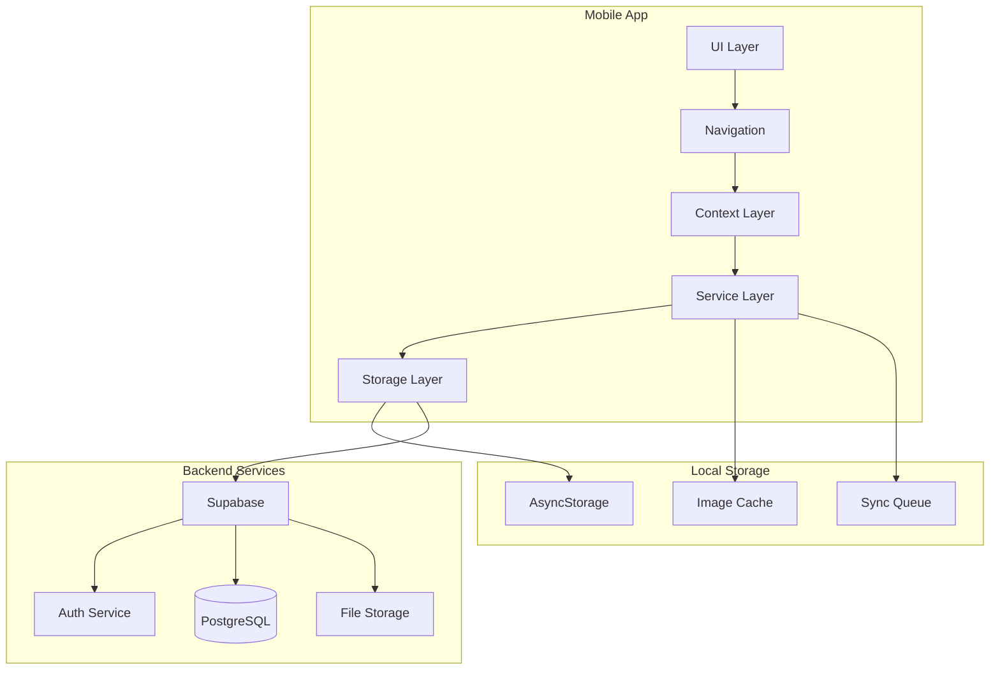

## 2. Authentication Flow

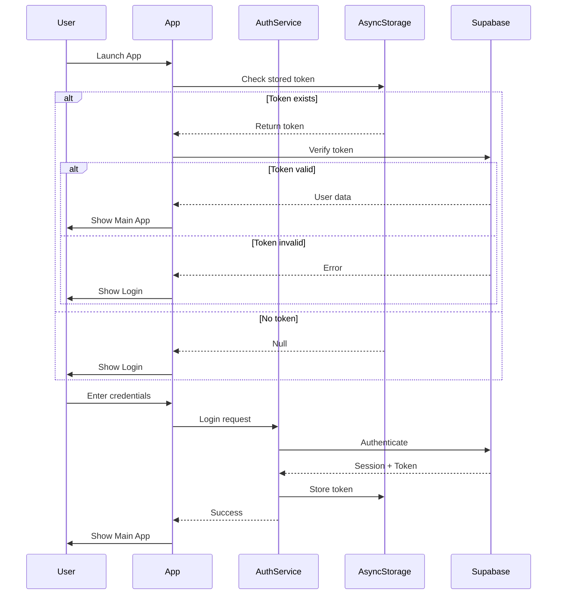

## 3. Workout Session Flow

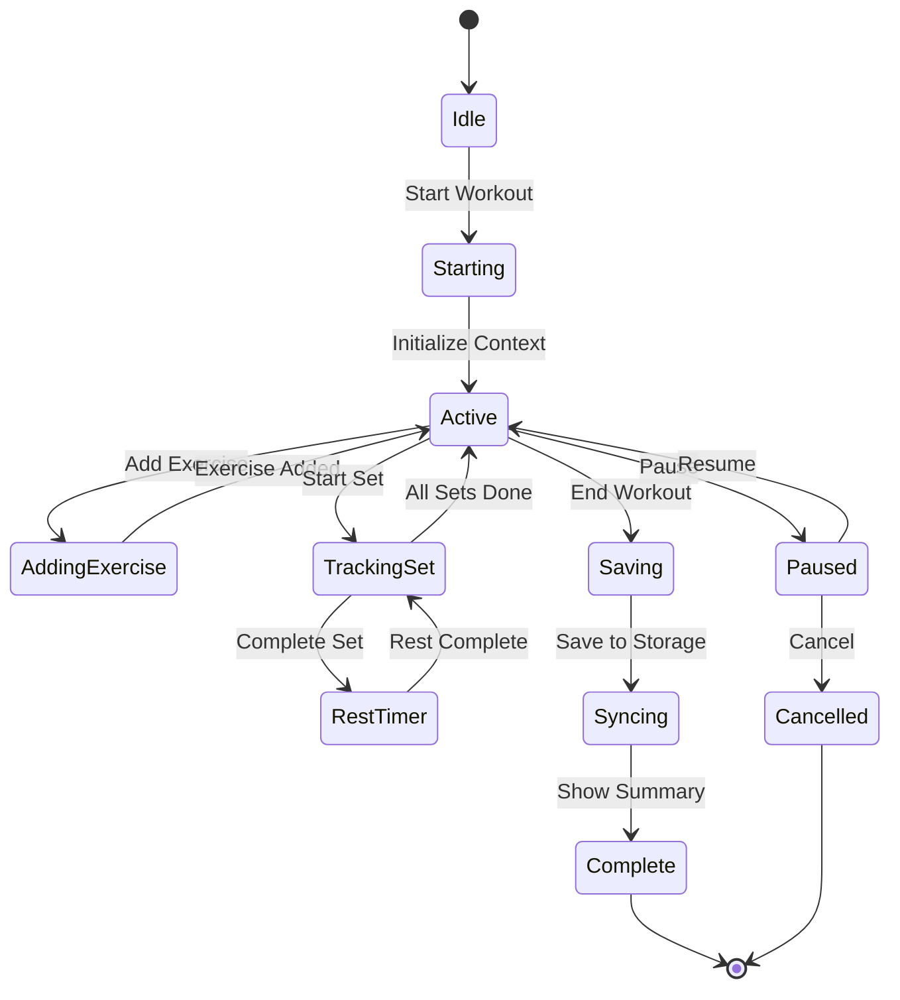

## 4. Data Sync Architecture

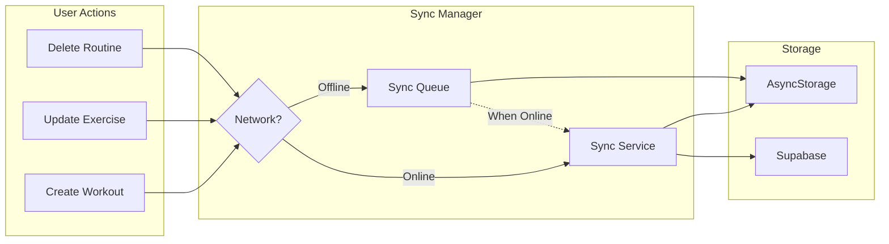

## 5. Component Hierarchy

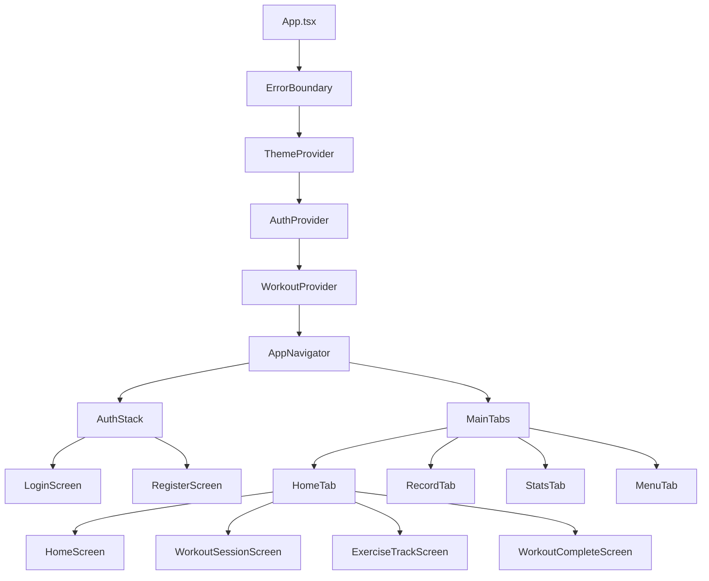

## 6. Service Layer Architecture

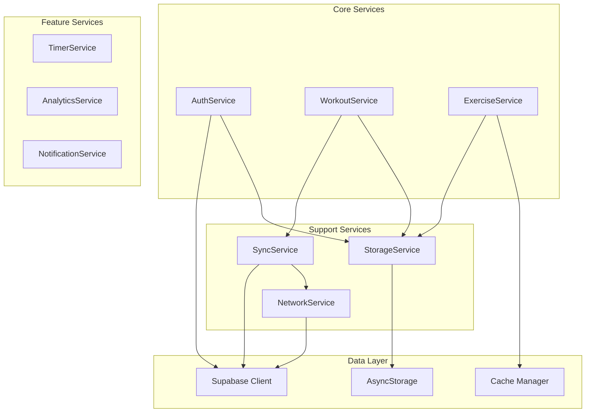

## 7. State Management Flow

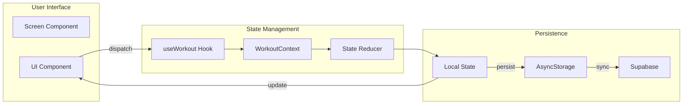

## 8. Navigation Structure

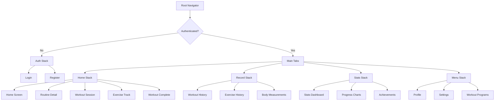

## 9. Error Handling Flow

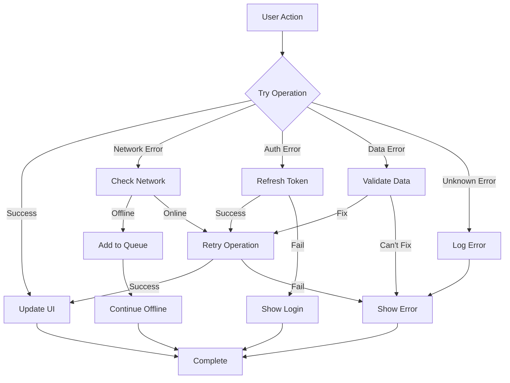

## 10. Performance Optimization Strategy

```mermaid
graph TD
    subgraph "Rendering Optimization"
        MEMO[React.memo]
        CALLBACK[useCallback]
        USEMEMO[useMemo]
    end
    
    subgraph "Data Optimization"
        LAZY[Lazy Loading]
        VIRTUAL[Virtual Lists]
        CACHE[Data Caching]
    end
    
    subgraph "Asset Optimization"
        STATIC[Static Imports]
        COMPRESS[Image Compression]
        BUNDLE[Code Splitting]
    end
    
    subgraph "Network Optimization"
        BATCH[Batch Requests]
        DEBOUNCE[Debounce]
        PREFETCH[Prefetch]
    end
    
    COMPONENTS[Components] --> MEMO
    HANDLERS[Event Handlers] --> CALLBACK
    CALCULATIONS[Heavy Calculations] --> USEMEMO
    
    LISTS[Large Lists] --> VIRTUAL
    IMAGES[Images] --> LAZY
    DATA[API Data] --> CACHE
    
    THUMBNAILS[Thumbnails] --> STATIC
    PHOTOS[Photos] --> COMPRESS
    FEATURES[Features] --> BUNDLE
    
    API[API Calls] --> BATCH
    SEARCH[Search] --> DEBOUNCE
    NAVIGATION[Navigation] --> PREFETCH
```

## 11. Database Schema

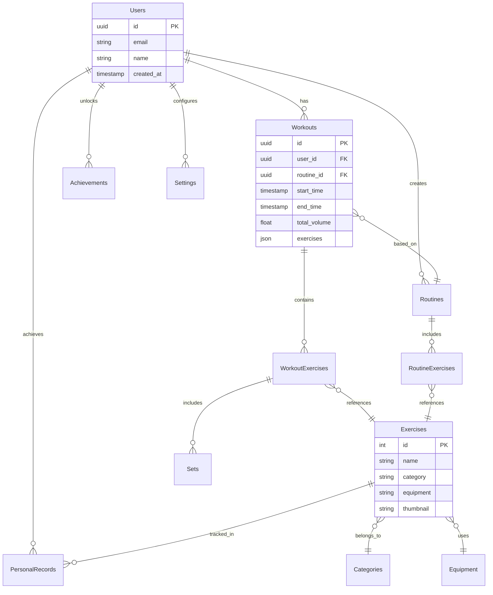

## 12. Deployment Pipeline

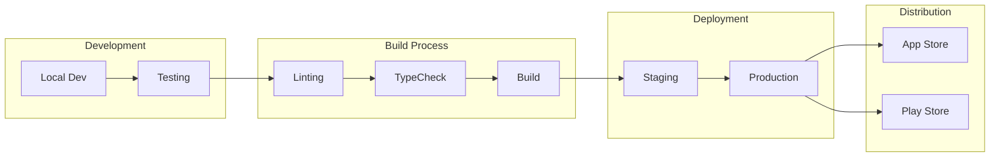